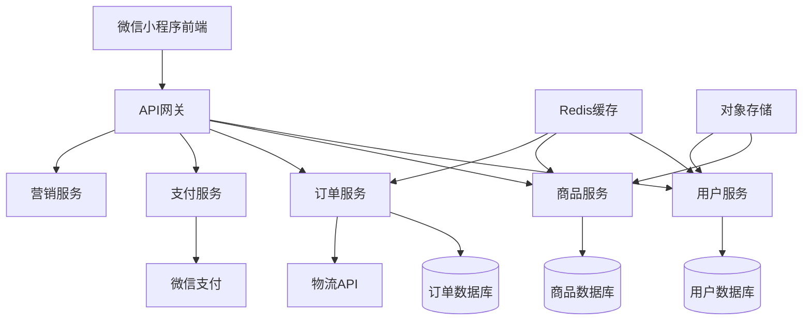

# 设计文档 - 茶叶电商微信小程序

## 概述

本文档描述了茶叶电商微信小程序的技术设计方案。该小程序是一个完整的电商平台，专注于销售茶叶、陈皮和紫砂壶三类产品，提供从商品浏览、购物、支付到售后的完整购物体验。

系统采用前后端分离架构，前端使用微信小程序原生框架开发，后端使用云开发或传统服务器架构，支持高并发访问和数据安全。

## 架构设计

### 整体架构

系统采用三层架构：

1. **表现层（Presentation Layer）**
   - 微信小程序前端
   - 使用WXML、WXSS、JavaScript开发
   - 负责用户界面展示和交互

2. **业务逻辑层（Business Logic Layer）**
   - 后端API服务
   - 处理业务逻辑、数据验证、权限控制
   - 提供RESTful API接口

3. **数据层（Data Layer）**
   - 数据库存储
   - 文件存储（商品图片、用户头像等）
   - 缓存系统（Redis）

### 技术选型

**前端技术栈：**
- 微信小程序原生框架
- WeUI 组件库（微信官方UI库）
- Vant Weapp（有赞UI组件库，可选）

**后端技术栈（方案一：云开发）：**
- 微信云开发
- 云函数（Node.js）
- 云数据库（MongoDB）
- 云存储

**后端技术栈（方案二：传统服务器）：**
- Node.js + Express 或 Python + Django/Flask
- MySQL 或 PostgreSQL 数据库
- Redis 缓存
- 阿里云OSS或腾讯云COS对象存储
- Nginx 反向代理

**第三方服务：**
- 微信支付API
- 物流查询API（快递100、快递鸟等）
- 短信服务（阿里云、腾讯云）

### 系统架构图



## 组件和接口

### 前端组件结构

```
pages/
├── index/              # 首页
├── category/           # 分类页
├── search/             # 搜索页
├── product/            # 商品详情
├── cart/               # 购物车
├── order/              
│   ├── confirm/        # 订单确认
│   ├── list/           # 订单列表
│   └── detail/         # 订单详情
├── user/               
│   ├── index/          # 个人中心
│   ├── address/        # 地址管理
│   ├── coupon/         # 优惠券
│   └── favorite/       # 收藏
├── group/              # 拼团
└── customer-service/   # 客服

components/
├── product-card/       # 商品卡片
├── order-item/         # 订单项
├── address-card/       # 地址卡片
├── coupon-card/        # 优惠券卡片
└── tab-bar/            # 底部导航栏
```

### 核心API接口设计

#### 用户相关接口

```
POST   /api/auth/login              # 用户登录
GET    /api/user/profile            # 获取用户信息
PUT    /api/user/profile            # 更新用户信息
GET    /api/user/addresses          # 获取收货地址列表
POST   /api/user/addresses          # 添加收货地址
PUT    /api/user/addresses/:id      # 更新收货地址
DELETE /api/user/addresses/:id      # 删除收货地址
```

#### 商品相关接口

```
GET    /api/products                # 获取商品列表（支持分类、搜索、分页）
GET    /api/products/:id            # 获取商品详情
GET    /api/categories              # 获取商品分类
GET    /api/products/:id/reviews    # 获取商品评价
POST   /api/products/:id/favorite   # 收藏商品
DELETE /api/products/:id/favorite   # 取消收藏
GET    /api/favorites               # 获取收藏列表
```

#### 购物车相关接口

```
GET    /api/cart                    # 获取购物车
POST   /api/cart/items              # 添加商品到购物车
PUT    /api/cart/items/:id          # 更新购物车商品数量
DELETE /api/cart/items/:id          # 删除购物车商品
DELETE /api/cart                    # 清空购物车
```

#### 订单相关接口

```
POST   /api/orders                  # 创建订单
GET    /api/orders                  # 获取订单列表
GET    /api/orders/:id              # 获取订单详情
PUT    /api/orders/:id/cancel       # 取消订单
PUT    /api/orders/:id/confirm      # 确认收货
POST   /api/orders/:id/review       # 评价订单
GET    /api/orders/:id/logistics    # 获取物流信息
```

#### 支付相关接口

```
POST   /api/payment/create          # 创建支付订单
POST   /api/payment/notify          # 支付回调通知
GET    /api/payment/status/:orderId # 查询支付状态
```

#### 营销相关接口

```
GET    /api/coupons                 # 获取优惠券列表
POST   /api/coupons/:id/claim       # 领取优惠券
GET    /api/user/coupons            # 获取用户优惠券
GET    /api/groups                  # 获取拼团活动列表
POST   /api/groups                  # 发起拼团
POST   /api/groups/:id/join         # 参与拼团
GET    /api/groups/:id              # 获取拼团详情
```

## 数据模型

### 用户表（users）

```javascript
{
  _id: ObjectId,
  openid: String,           // 微信openid
  unionid: String,          // 微信unionid（可选）
  nickname: String,         // 昵称
  avatar: String,           // 头像URL
  phone: String,            // 手机号
  memberLevel: Number,      // 会员等级 0-普通 1-银卡 2-金卡
  totalSpent: Number,       // 累计消费金额
  createdAt: Date,
  updatedAt: Date
}
```

### 收货地址表（addresses）

```javascript
{
  _id: ObjectId,
  userId: ObjectId,         // 用户ID
  name: String,             // 收货人姓名
  phone: String,            // 手机号
  province: String,         // 省
  city: String,             // 市
  district: String,         // 区
  detail: String,           // 详细地址
  isDefault: Boolean,       // 是否默认地址
  createdAt: Date,
  updatedAt: Date
}
```

### 商品表（products）

```javascript
{
  _id: ObjectId,
  name: String,             // 商品名称
  category: String,         // 分类：tea/chenpi/teapot
  images: [String],         // 商品图片URL数组
  description: String,      // 商品描述
  price: Number,            // 价格（分）
  originalPrice: Number,    // 原价（分）
  stock: Number,            // 库存
  sales: Number,            // 销量
  rating: Number,           // 平均评分
  reviewCount: Number,      // 评价数量
  specs: [{                 // 规格
    name: String,           // 规格名称
    options: [String]       // 规格选项
  }],
  skus: [{                  // SKU
    specValues: [String],   // 规格值组合
    price: Number,          // SKU价格
    stock: Number,          // SKU库存
    skuCode: String         // SKU编码
  }],
  status: Number,           // 状态 0-下架 1-上架
  createdAt: Date,
  updatedAt: Date
}
```

### 购物车表（cart_items）

```javascript
{
  _id: ObjectId,
  userId: ObjectId,         // 用户ID
  productId: ObjectId,      // 商品ID
  skuCode: String,          // SKU编码
  quantity: Number,         // 数量
  selected: Boolean,        // 是否选中
  createdAt: Date,
  updatedAt: Date
}
```

### 订单表（orders）

```javascript
{
  _id: ObjectId,
  orderNo: String,          // 订单号
  userId: ObjectId,         // 用户ID
  items: [{                 // 订单商品
    productId: ObjectId,
    productName: String,
    productImage: String,
    skuCode: String,
    specText: String,       // 规格文本
    price: Number,          // 单价（分）
    quantity: Number,       // 数量
    subtotal: Number        // 小计（分）
  }],
  totalAmount: Number,      // 总金额（分）
  discountAmount: Number,   // 优惠金额（分）
  payAmount: Number,        // 实付金额（分）
  couponId: ObjectId,       // 使用的优惠券ID
  address: {                // 收货地址
    name: String,
    phone: String,
    province: String,
    city: String,
    district: String,
    detail: String
  },
  status: Number,           // 订单状态 0-待付款 1-待发货 2-待收货 3-已完成 4-已取消
  paymentStatus: Number,    // 支付状态 0-未支付 1-已支付
  paymentTime: Date,        // 支付时间
  deliveryTime: Date,       // 发货时间
  receiveTime: Date,        // 收货时间
  logistics: {              // 物流信息
    company: String,        // 物流公司
    trackingNo: String      // 物流单号
  },
  remark: String,           // 订单备注
  createdAt: Date,
  updatedAt: Date
}
```

### 评价表（reviews）

```javascript
{
  _id: ObjectId,
  orderId: ObjectId,        // 订单ID
  userId: ObjectId,         // 用户ID
  productId: ObjectId,      // 商品ID
  rating: Number,           // 评分 1-5
  content: String,          // 评价内容
  images: [String],         // 评价图片
  createdAt: Date
}
```

### 优惠券表（coupons）

```javascript
{
  _id: ObjectId,
  name: String,             // 优惠券名称
  type: Number,             // 类型 1-满减 2-折扣
  value: Number,            // 面额（分）或折扣（如85表示8.5折）
  minAmount: Number,        // 最低消费金额（分）
  total: Number,            // 发行总量
  claimed: Number,          // 已领取数量
  validFrom: Date,          // 有效期开始
  validTo: Date,            // 有效期结束
  status: Number,           // 状态 0-未开始 1-进行中 2-已结束
  createdAt: Date
}
```

### 用户优惠券表（user_coupons）

```javascript
{
  _id: ObjectId,
  userId: ObjectId,         // 用户ID
  couponId: ObjectId,       // 优惠券ID
  status: Number,           // 状态 0-未使用 1-已使用 2-已过期
  usedAt: Date,             // 使用时间
  orderId: ObjectId,        // 使用的订单ID
  claimedAt: Date           // 领取时间
}
```

### 拼团活动表（group_activities）

```javascript
{
  _id: ObjectId,
  productId: ObjectId,      // 商品ID
  groupPrice: Number,       // 拼团价格（分）
  originalPrice: Number,    // 原价（分）
  requiredCount: Number,    // 成团人数
  duration: Number,         // 拼团时长（小时）
  stock: Number,            // 拼团库存
  validFrom: Date,          // 活动开始时间
  validTo: Date,            // 活动结束时间
  status: Number,           // 状态 0-未开始 1-进行中 2-已结束
  createdAt: Date
}
```

### 拼团记录表（groups）

```javascript
{
  _id: ObjectId,
  activityId: ObjectId,     // 拼团活动ID
  leaderId: ObjectId,       // 团长用户ID
  status: Number,           // 状态 0-拼团中 1-拼团成功 2-拼团失败
  currentCount: Number,     // 当前人数
  requiredCount: Number,    // 成团人数
  members: [{               // 成员列表
    userId: ObjectId,
    orderId: ObjectId,
    joinedAt: Date
  }],
  expireAt: Date,           // 过期时间
  createdAt: Date,
  updatedAt: Date
}
```

## UI/UX 设计说明

### 设计原则

1. **简洁优雅**：采用简洁的设计风格，突出商品本身的品质感
2. **易用性**：操作流程简单直观，减少用户学习成本
3. **品牌感**：使用茶文化相关的视觉元素，营造文化氛围
4. **响应式**：适配不同尺寸的手机屏幕

### 色彩方案

- **主色调**：深绿色 (#2C5F2D) - 代表茶叶的自然属性
- **辅助色**：棕色 (#8B4513) - 代表紫砂和陈皮的质感
- **强调色**：金色 (#D4AF37) - 用于会员标识和重要按钮
- **背景色**：浅灰 (#F5F5F5) - 提供舒适的阅读体验
- **文字色**：深灰 (#333333) 和浅灰 (#999999)

### 页面设计要点

#### 首页

- 顶部搜索栏固定，方便快速搜索
- 轮播图展示主推商品和活动
- 商品分类入口使用图标+文字形式
- 拼团专区突出显示，吸引用户参与
- 商品列表采用瀑布流或网格布局

#### 商品详情页

- 顶部大图轮播，支持图片放大查看
- 商品信息清晰展示：名称、价格、销量、评分
- 规格选择器采用弹窗形式，避免页面过长
- 商品详情使用富文本展示，支持图文混排
- 底部固定操作栏：加入购物车、立即购买

#### 购物车

- 商品列表支持滑动删除
- 全选/反选功能明显
- 实时计算总价
- 失效商品单独展示

#### 订单确认页

- 收货地址卡片式展示，支持快速切换
- 商品清单简洁展示
- 优惠券选择入口明显
- 价格明细清晰展示

#### 订单列表

- Tab切换不同状态的订单
- 订单卡片展示关键信息
- 操作按钮根据订单状态动态显示

#### 个人中心

- 顶部展示用户信息和会员等级
- 订单状态快捷入口
- 功能列表清晰分组

### 交互设计

1. **加载状态**：使用骨架屏提升加载体验
2. **下拉刷新**：支持下拉刷新数据
3. **上拉加载**：列表支持上拉加载更多
4. **Toast提示**：操作反馈使用Toast轻提示
5. **确认对话框**：重要操作（删除、取消订单）需要二次确认
6. **动画效果**：页面切换和元素交互使用流畅的动画

### 响应式设计

- 使用rpx单位适配不同屏幕
- 图片使用合适的压缩和懒加载
- 列表项高度自适应内容
- 按钮和可点击区域保证足够的点击区域（最小44rpx）

## 正确性属性

*属性是一个特征或行为，应该在系统的所有有效执行中保持为真——本质上是关于系统应该做什么的形式化陈述。属性作为人类可读规范和机器可验证正确性保证之间的桥梁。*

### 验收标准可测试性分析

基于需求文档中的验收标准，以下是关键功能的可测试性分析：

**需求1 - 用户注册与登录**
- 1.2 自动创建账户：可测试（属性）- 验证授权成功后用户记录被创建
- 1.4 自动登录恢复：可测试（属性）- 验证有效token能恢复登录状态

**需求2 - 商品分类浏览**
- 2.2 分类过滤：可测试（属性）- 验证返回的商品都属于选定分类
- 2.3 商品信息展示：可测试（属性）- 验证商品卡片包含必需字段

**需求3 - 商品搜索**
- 3.3 搜索匹配：可测试（属性）- 验证搜索结果包含关键词
- 3.5 搜索历史：可测试（属性）- 验证历史记录不超过10条

**需求4 - 商品详情展示**
- 4.4 规格选择更新价格：可测试（属性）- 验证选择规格后价格和库存正确更新

**需求5 - 购物车管理**
- 5.1 添加商品：可测试（属性）- 验证商品被添加到购物车
- 5.2 数量累加：可测试（属性）- 验证重复添加增加数量而非创建新记录
- 5.4 实时更新总价：可测试（属性）- 验证总价等于所有选中商品的小计之和
- 5.6 库存不足标记：可测试（属性）- 验证库存不足的商品被正确标记

**需求6 - 订单创建**
- 6.4 库存验证：可测试（属性）- 验证订单创建时检查库存
- 6.5 库存不足阻止：可测试（属性）- 验证库存不足时订单创建失败
- 6.6 生成唯一订单号：可测试（属性）- 验证订单号唯一性

**需求7 - 支付处理**
- 7.2 支付成功更新状态：可测试（属性）- 验证支付成功后订单状态更新
- 7.6 超时自动取消：可测试（属性）- 验证30分钟后未支付订单被取消

**需求8 - 订单管理**
- 8.2 状态筛选：可测试（属性）- 验证筛选返回正确状态的订单
- 8.8 取消订单释放库存：可测试（属性）- 验证取消订单后库存恢复

**需求10 - 收货地址管理**
- 10.3 手机号验证：可测试（属性）- 验证手机号必须是11位数字
- 10.7 地址数量限制：可测试（属性）- 验证用户最多20个地址

**需求11 - 商品评价**
- 11.3 更新平均评分：可测试（属性）- 验证提交评价后商品评分正确更新
- 11.6 已评价不重复：可测试（属性）- 验证已评价订单不能再次评价

**需求13 - 优惠券系统**
- 13.4 自动匹配可用优惠券：可测试（属性）- 验证只显示满足条件的优惠券
- 13.5 计算折扣：可测试（属性）- 验证优惠券折扣计算正确
- 13.7 取消订单退还优惠券：可测试（属性）- 验证取消订单后优惠券状态恢复

**需求14 - 拼团活动**
- 14.4 拼团成功条件：可测试（属性）- 验证人数达标时拼团成功
- 14.5 拼团失败退款：可测试（属性）- 验证超时未成团时退款

**需求15 - 会员系统**
- 15.1 自动升级：可测试（属性）- 验证消费达标后会员等级自动升级
- 15.4 会员折扣：可测试（属性）- 验证会员价格计算正确

**需求19 - 商品库存管理**
- 19.1 下单锁定库存：可测试（属性）- 验证下单时库存被锁定
- 19.2 支付扣减库存：可测试（属性）- 验证支付成功后库存扣减
- 19.3 取消释放库存：可测试（属性）- 验证取消订单后库存释放

### 核心正确性属性

基于上述分析，以下是系统的核心正确性属性：

**属性 1：购物车总价一致性**
*对于任意*购物车状态，购物车显示的总价应该等于所有选中商品的（单价 × 数量）之和
**验证需求：5.4**

**属性 2：商品分类过滤正确性**
*对于任意*商品分类查询，返回的所有商品的category字段都应该等于查询的分类值
**验证需求：2.2**

**属性 3：搜索结果相关性**
*对于任意*搜索关键词，返回的所有商品的名称或描述都应该包含该关键词（不区分大小写）
**验证需求：3.3**

**属性 4：订单号唯一性**
*对于任意*两个不同的订单，它们的订单号应该不相同
**验证需求：6.6**

**属性 5：库存一致性（下单锁定）**
*对于任意*商品，当创建订单时，该商品的可用库存应该减少订单中该商品的数量
**验证需求：19.1**

**属性 6：库存一致性（支付扣减）**
*对于任意*订单，当支付成功后，订单中所有商品的实际库存应该减少对应的数量
**验证需求：19.2**

**属性 7：库存一致性（取消释放）**
*对于任意*已取消或超时的订单，订单中所有商品的可用库存应该恢复到下单前的数量
**验证需求：19.3, 8.8**

**属性 8：购物车商品去重**
*对于任意*用户和商品SKU，购物车中最多只应该存在一条该用户和该SKU的记录，重复添加应该增加数量
**验证需求：5.2**

**属性 9：优惠券折扣计算正确性**
*对于任意*订单和满减优惠券，如果订单金额 >= 优惠券最低消费，则实付金额 = 订单金额 - 优惠券面额
**验证需求：13.5**

**属性 10：优惠券状态恢复**
*对于任意*使用了优惠券的订单，如果订单被取消，则该优惠券的状态应该恢复为未使用
**验证需求：13.7**

**属性 11：手机号格式验证**
*对于任意*收货地址，其手机号字段应该是恰好11位的数字字符串
**验证需求：10.3**

**属性 12：地址数量限制**
*对于任意*用户，其收货地址数量应该不超过20个
**验证需求：10.7**

**属性 13：搜索历史限制**
*对于任意*用户，其搜索历史记录数量应该不超过10条，超过时应该删除最旧的记录
**验证需求：3.5**

**属性 14：订单状态筛选正确性**
*对于任意*订单状态筛选查询，返回的所有订单的status字段都应该等于查询的状态值
**验证需求：8.2**

**属性 15：商品评分更新正确性**
*对于任意*商品，当添加新评价后，商品的平均评分应该等于所有评价评分的算术平均值
**验证需求：11.3**

**属性 16：评价唯一性**
*对于任意*订单和用户，该用户对该订单中的每个商品最多只能评价一次
**验证需求：11.6**

**属性 17：拼团成功条件**
*对于任意*拼团记录，当且仅当参团人数达到要求人数时，拼团状态应该标记为成功
**验证需求：14.4**

**属性 18：拼团超时处理**
*对于任意*拼团记录，如果当前时间超过过期时间且人数未达标，则拼团状态应该标记为失败，且所有参团订单应该退款
**验证需求：14.5**

**属性 19：会员等级自动升级**
*对于任意*用户，当其累计消费金额达到会员等级阈值时，会员等级应该自动升级到对应等级
**验证需求：15.1, 15.3**

**属性 20：库存不足阻止下单**
*对于任意*订单创建请求，如果任何商品的可用库存小于订单中该商品的数量，则订单创建应该失败
**验证需求：6.5**

**属性 21：支付超时自动取消**
*对于任意*订单，如果创建时间超过30分钟且支付状态为未支付，则订单状态应该自动更新为已取消，且库存应该释放
**验证需求：7.6**

**属性 22：规格选择价格更新**
*对于任意*商品和规格选择，显示的价格和库存应该等于对应SKU的价格和库存
**验证需求：4.4**


## 错误处理

### 错误分类

系统错误分为以下几类：

1. **客户端错误（4xx）**
   - 400 Bad Request：请求参数错误
   - 401 Unauthorized：未授权，需要登录
   - 403 Forbidden：无权限访问
   - 404 Not Found：资源不存在
   - 409 Conflict：资源冲突（如库存不足）
   - 422 Unprocessable Entity：业务逻辑错误

2. **服务器错误（5xx）**
   - 500 Internal Server Error：服务器内部错误
   - 502 Bad Gateway：网关错误
   - 503 Service Unavailable：服务不可用
   - 504 Gateway Timeout：网关超时

### 错误响应格式

所有API错误响应统一使用以下格式：

```javascript
{
  code: Number,        // 错误码
  message: String,     // 错误消息
  details: Object      // 详细错误信息（可选）
}
```

### 常见错误场景处理

**库存不足**
- 错误码：409
- 消息：商品库存不足
- 处理：提示用户并阻止下单

**支付失败**
- 错误码：422
- 消息：支付失败，请重试
- 处理：保留订单，允许重新支付

**优惠券不可用**
- 错误码：422
- 消息：优惠券不满足使用条件
- 处理：提示用户并移除优惠券

**地址数量超限**
- 错误码：422
- 消息：收货地址数量已达上限
- 处理：提示用户删除旧地址

**订单不存在**
- 错误码：404
- 消息：订单不存在
- 处理：返回订单列表页

**网络超时**
- 错误码：504
- 消息：网络请求超时，请重试
- 处理：显示重试按钮

### 前端错误处理策略

1. **全局错误拦截**：在请求拦截器中统一处理错误响应
2. **用户友好提示**：将技术错误转换为用户可理解的提示
3. **自动重试**：对于网络错误，提供自动重试机制
4. **降级处理**：关键功能失败时提供降级方案
5. **错误日志**：记录错误日志用于问题排查

### 数据一致性保证

1. **事务处理**：订单创建、支付等关键操作使用数据库事务
2. **乐观锁**：库存扣减使用乐观锁防止超卖
3. **幂等性**：支付回调等接口保证幂等性
4. **补偿机制**：支付失败、拼团失败等场景提供补偿机制

## 测试策略

### 测试方法

系统采用双重测试方法：

1. **单元测试**：测试具体示例、边界情况和错误条件
2. **属性测试**：通过随机化输入验证通用属性

两种测试方法互补，共同保证系统的正确性和健壮性。

### 单元测试策略

**测试重点**：
- 具体业务场景的正确性
- 边界条件和异常情况
- 组件间的集成点
- 错误处理逻辑

**测试工具**：
- 前端：Jest + @testing-library/react
- 后端：Jest（Node.js）或 pytest（Python）
- API测试：Postman + Newman

**测试覆盖率目标**：
- 核心业务逻辑：>90%
- 工具函数：>80%
- 整体代码：>70%

### 属性测试策略

**测试重点**：
- 验证设计文档中定义的正确性属性
- 通过大量随机输入发现边界问题
- 验证数据一致性和业务规则

**测试工具**：
- JavaScript：fast-check
- Python：Hypothesis

**测试配置**：
- 每个属性测试最少运行100次迭代
- 每个测试必须引用设计文档中的属性编号
- 标签格式：**Feature: tea-shop-miniprogram, Property {number}: {property_text}**

### 属性测试示例

```javascript
// 属性1：购物车总价一致性
// Feature: tea-shop-miniprogram, Property 1: 购物车总价等于所有选中商品小计之和
test('cart total price consistency', () => {
  fc.assert(
    fc.property(
      fc.array(cartItemArbitrary),
      (items) => {
        const cart = new Cart(items);
        const expectedTotal = items
          .filter(item => item.selected)
          .reduce((sum, item) => sum + item.price * item.quantity, 0);
        expect(cart.getTotalPrice()).toBe(expectedTotal);
      }
    ),
    { numRuns: 100 }
  );
});

// 属性11：手机号格式验证
// Feature: tea-shop-miniprogram, Property 11: 手机号必须是11位数字
test('phone number format validation', () => {
  fc.assert(
    fc.property(
      fc.string(),
      (phone) => {
        const isValid = /^\d{11}$/.test(phone);
        const result = validatePhone(phone);
        expect(result.valid).toBe(isValid);
      }
    ),
    { numRuns: 100 }
  );
});
```

### 集成测试

**测试场景**：
- 完整的购物流程：浏览 → 加购 → 下单 → 支付 → 收货
- 拼团流程：发起 → 参团 → 成团 → 发货
- 优惠券流程：领取 → 使用 → 退还
- 会员升级流程：消费 → 自动升级 → 享受权益

**测试环境**：
- 使用独立的测试数据库
- 模拟微信支付接口
- 模拟物流查询接口

### 性能测试

**测试指标**：
- 接口响应时间：<200ms（P95）
- 并发用户数：>1000
- 数据库查询时间：<50ms
- 页面加载时间：<2s

**测试工具**：
- JMeter 或 Locust 进行压力测试
- Lighthouse 进行前端性能测试

### 安全测试

**测试项目**：
- SQL注入防护
- XSS攻击防护
- CSRF攻击防护
- 敏感信息加密
- 权限验证

### 测试环境

1. **开发环境（Dev）**：开发人员本地测试
2. **测试环境（Test）**：QA团队功能测试
3. **预发布环境（Staging）**：生产前最后验证
4. **生产环境（Production）**：正式运行环境

### 持续集成

- 使用GitHub Actions或GitLab CI进行自动化测试
- 每次代码提交自动运行单元测试和属性测试
- 测试失败阻止代码合并
- 定期运行集成测试和性能测试

## 安全性设计

### 身份认证

- 使用微信官方登录接口获取用户身份
- 后端生成JWT token用于会话管理
- Token有效期设置为7天，支持刷新

### 数据加密

- HTTPS加密传输
- 敏感信息（手机号、地址）数据库加密存储
- 支付相关数据使用微信支付加密规范

### 权限控制

- 用户只能访问自己的订单、地址、优惠券等数据
- 管理员接口需要额外的权限验证
- 敏感操作（取消订单、确认收货）需要二次验证

### 防刷机制

- 接口限流：同一用户同一接口每秒最多10次请求
- 优惠券领取：同一用户同一优惠券只能领取一次
- 拼团发起：同一用户同一商品同时只能发起一个拼团

### 数据备份

- 数据库每日自动备份
- 备份数据保留30天
- 支持快速恢复

## 部署方案

### 云开发部署（推荐）

**优势**：
- 无需管理服务器
- 自动扩容
- 与微信小程序深度集成
- 开发效率高

**部署步骤**：
1. 在微信开发者工具中开通云开发
2. 创建云函数并部署
3. 配置云数据库集合和索引
4. 配置云存储权限
5. 配置环境变量

### 传统服务器部署

**架构**：
- 前端：微信小程序
- 后端：Node.js/Python应用服务器
- 数据库：MySQL/PostgreSQL主从架构
- 缓存：Redis集群
- 负载均衡：Nginx
- 对象存储：阿里云OSS/腾讯云COS

**部署步骤**：
1. 购买云服务器和数据库
2. 配置Nginx反向代理和HTTPS证书
3. 部署后端应用（使用PM2或Docker）
4. 配置数据库和Redis
5. 配置对象存储
6. 配置域名和备案

### 监控和运维

**监控指标**：
- 服务器CPU、内存、磁盘使用率
- 接口响应时间和错误率
- 数据库连接数和慢查询
- 用户访问量和活跃度

**监控工具**：
- 云开发：微信云开发控制台
- 传统服务器：Prometheus + Grafana

**日志管理**：
- 应用日志：记录关键操作和错误
- 访问日志：记录所有API请求
- 错误日志：记录异常和错误堆栈
- 日志保留：30天

**告警机制**：
- 服务器资源告警
- 接口错误率告警
- 数据库异常告警
- 支付异常告警

## 扩展性考虑

### 功能扩展

系统设计支持以下功能扩展：

1. **多商户模式**：支持多个商家入驻
2. **积分系统**：用户消费获得积分，积分可兑换商品
3. **分销系统**：用户推广获得佣金
4. **直播带货**：集成微信直播功能
5. **社区功能**：用户分享、评论、点赞
6. **AI推荐**：基于用户行为的智能推荐

### 技术扩展

1. **微服务化**：将单体应用拆分为微服务
2. **消息队列**：使用RabbitMQ或Kafka处理异步任务
3. **搜索引擎**：使用Elasticsearch提升搜索性能
4. **CDN加速**：使用CDN加速图片和静态资源
5. **数据分析**：集成数据分析平台

## 总结

本设计文档详细描述了茶叶电商微信小程序的技术架构、组件设计、数据模型、UI/UX设计、正确性属性、错误处理、测试策略、安全性设计和部署方案。

系统采用前后端分离架构，支持云开发和传统服务器两种部署方式。通过完善的正确性属性定义和双重测试策略（单元测试+属性测试），确保系统的正确性和健壮性。

设计充分考虑了电商系统的核心需求：库存一致性、订单流程、支付安全、营销活动等，并提供了完善的错误处理和安全机制。系统具有良好的扩展性，可以根据业务发展需要进行功能和技术扩展。
